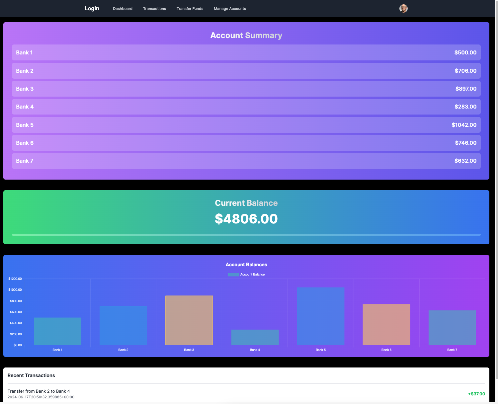

# Personal Finance App




This is a full-stack personal finance application built using React.js, Next.js, Django, MongoDB, and hosted on AWS. It provides users with a responsive interface to manage their finances securely.


## Features

- **Responsive User Interface**: Designed with React.js for a seamless user experience.
- **Secure Backend**: Developed using Django with robust authentication and authorization mechanisms.
- **Flexible Database Management**: Utilizes MongoDB for efficient storage and retrieval of user account information and transaction history.
- **AWS Deployment**: Deployed on AWS to ensure reliability and scalability.
- **Core Financial Functionalities**: Includes total balance tracking, multiple account management, transfers, and deposits.

## Getting Started

To get started with this project, follow these steps:

1. Clone the repository:

```bash
git clone https://github.com/yourusername/your-repo-name.git
cd your-repo-name
Install the frontend dependencies:
bash
Copy code
cd frontend
npm install
# or
yarn install
# or
pnpm install
# or
bun install
Install the backend dependencies:
bash
Copy code
cd backend
pip install -r requirements.txt
Set up the MongoDB database and configure your environment variables for the database connection and AWS deployment.

Run the frontend development server:

bash
Copy code
cd frontend
npm run dev
# or
yarn dev
# or
pnpm dev
# or
bun dev
Run the backend development server:
bash
Copy code
cd backend
python manage.py runserver
Open http://localhost:3000 with your browser to see the frontend, and http://localhost:8000 for the backend.
Project Structure
frontend/: Contains the React.js and Next.js code for the user interface.
backend/: Contains the Django code for the backend services.
config/: Contains configuration files for the project, including environment variables and AWS settings.
